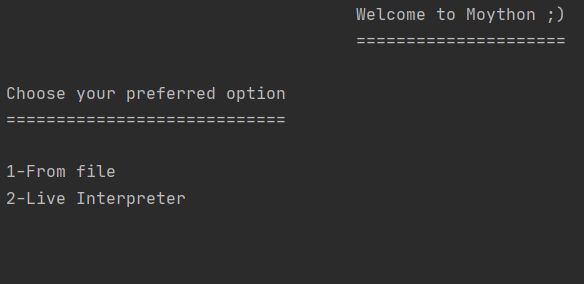
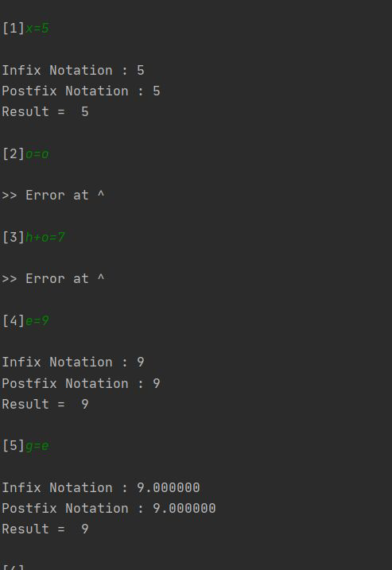
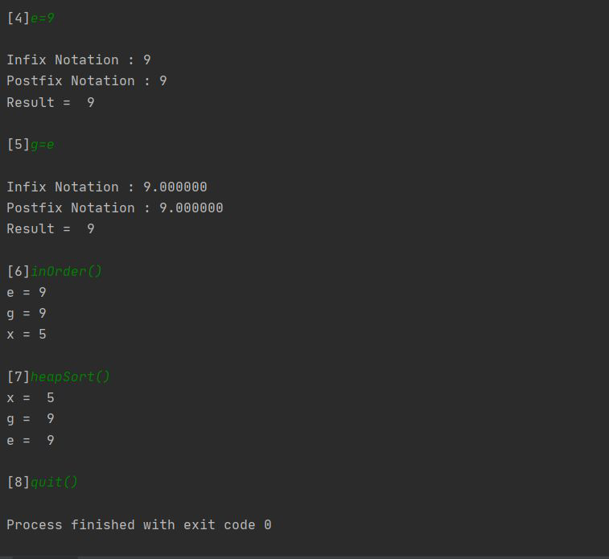
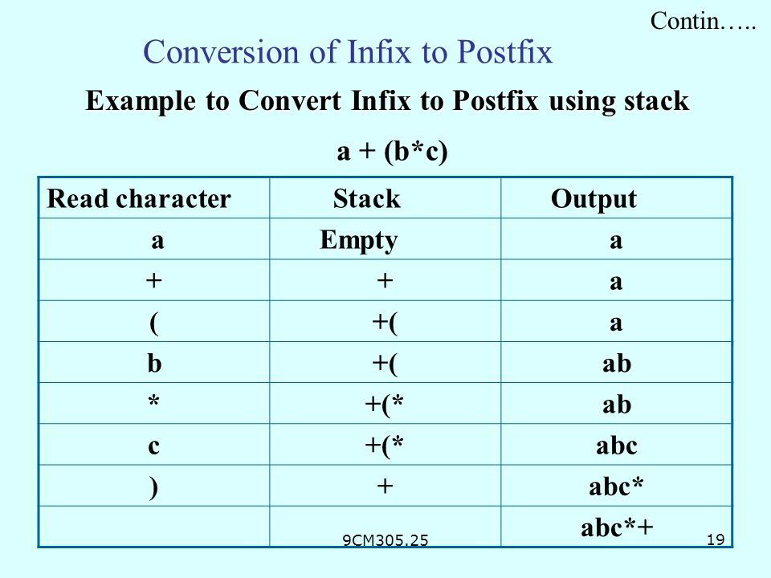
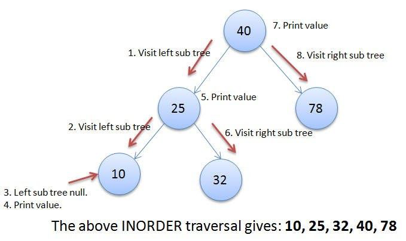
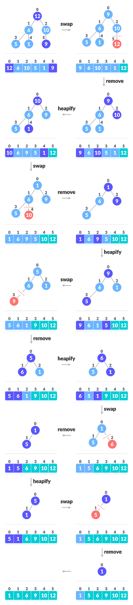



**Simple Interpreter**

06.2020

**\_\_\_\_\_\_**

Name\_ID’s

Ahmed Mohye El-Din Ibrahim Shapiro\_5846

Noha Sayed Mohammed Ali Mohammed El-Haddad\_5891 Samar Ashraf Mohamed Elgamal\_5505

Yassin Mohsen Ahmed Nawar\_5517

Ahmed Yasser\_5661
`  `PAGE7

**System Description-------------------------------------------------------------------Page 2**

**User Manual----------------------------------------------------------------------------- Page 3**

**Functionality:**

**Stacks------------------------------------------------------------------------------- --------Page 4**

**Binary Search Trees-------------------------------------------------------------------Page 5** **Heaps------------------------------------------------------------------------------- --------Page 6**

**System Description:**

What is a simple interpreter:

`   `A simple interpreter calculates a mathematical expression with the priorities according to the operation done, subtraction,addition,division, or/and multiplication.

`  `Our system can also save the calculated value in a variable (key), you should enter the variable like this : x= 1 for example , and insert both of them, key and value, in a Binary Search Tree sorted according to the variable name (key).

`  `After you finish inserting all the expressions ,they will be printed , first, according to the keys using in-order traversal for Binary Search Tree , then they will be printed according to the values sorted ascendingly using Heap Sort Algorithm.

We used C++ for the development of the code.

We used some libraries:

- STL : Standard Template Library , a library of container  classes, algorithms, and iterators. For example we used from container classes the Vectors; they are

same as dynamic arrays with the ability to resize itself automatically when an element is inserted or deleted, with their storage being handled automatically by the container.

- <regex> header : Regular expressions are a standardized way to express patterns to be matched against sequences of characters.
- <string>header : for example we used the public member function “substr(int pos)” as it returns a newly constructed string object with its value initialized to a copy of a substring of this object.

The substring is the portion of the object that starts at character position pos and spans len characters (or until the end of the string, whichever comes first).

**User manual:**

` `First you have the Choice to either let the program read from a txt file or you can write the input from the keyboard .

- If you want to read from file, enter number 1, and read screen and write file name.
- If you want to manually put the input , enter number 2

`  `If you want to enter the input manually, you will enter the expression like this : x=8 or x=2+3, if you entered anything different for example: x+7=9 , or anything similar, we handled such thing and you will be obligated to enter the right form of the expression. To do that enter “inorder()”.

`  `After you Finish, you have the choice to Print elements in the inorder traversal according to the variable/key you stored the value in it or Print the elements Sorted according to their values, you wanted to calculate them before ,in an ascending order. To do that enter ”heapSort()”.

`  `If you finish everything you can quit and exit the program by entering “quit()”.

**Functionality:**

`  `As we used some of the Data Structures, as Stacks, Binary Search Trees, and Heaps, we’ll briefly summarize why and how we used each one.

Stacks:

` `as we want to convert from infix to postfix , we use stacks.

Infix expressions are readable and solvable by us. We can easily distinguish the order of operators, and also can use the parenthesis to solve that part first during solving mathematical expressions. The computer cannot differentiate the operators and parentheses easily, that’s why postfix conversion is needed. 

For the conversion from infix expression to postfix expression, we will use the Stack. By scanning the infix expression from left to right, when we will get any operand, add them to the postfix form, and for the operator and parenthesis, add them in the stack maintaining the precedence of them. 

Like that we successfully evaluated the expression you put , then if you wanted to save the calculated value in a variable aka : key , we will use Binary Search Tree. 

Binary Search Tree: 

It is a binary tree which is node-based, and it has some properties: 

- The left subtree of a node contains only nodes with keys lesser than the

node’s key.

- The right subtree of a node contains only nodes with keys greater than the node’s key.
- The left and right subtree each must also be a binary search tree.

`  `We use an extremely useful property in trees which is the traversing; unlike linear data structures (Array, Linked List, Queues, Stacks, etc) which have only one logical way to traverse them, trees can be traversed in different ways, inorder, preorder and postorder.

`  `In our project, we will use the inorder traversal, (Left, Root, Right),these are the steps to write an inorder traversal from a binary search tree.

we use strings instead of integers in 

the binary search tree, however, it is the same process. 

And like that we print the values you have saved in a key in an inorder traversal. 

Finally, we now use a different algorithm to sort the values of this tree, with the help of heaps. 

Heaps: 

A Heap is a special Tree-based data structure in which the tree is a complete binary tree. Generally, Heaps can be of two types:

1. **Max-Heap​**: In a Max-Heap the key present at the root node must be greatest among the keys present at all of its children. The same property must be recursively true for all sub-trees in that Binary Tree.
1. **Min-Heap​**: In a Min-Heap the key present at the root node must be minimum among the keys present at all of its children. The same property must be recursively true for all sub-trees in that Binary Tree.

In our project, we convert the Binary Search Tree into a max Heap using a function we’ve built. We do that to create a heap, and like that we use the useful property of heap which is Heap Sort.

**Heap Sort Algorithm for sorting in increasing order:**

1. Build a max heap from the input data.
1. At this point, the largest item is stored at the root of the heap. Replace it with the last item of the heap followed by reducing the size of heap by 1, and at the same time put the root at the end of the array. Finally, heapify, or in other words, make the tree a max heap again by swapping elements.
1. Repeat step 2 while size of heap is less by 1.

Like that we will have a sorted array/vector according to the value you saved before, then we print it, as obviously it will be printed in an ascending order.

